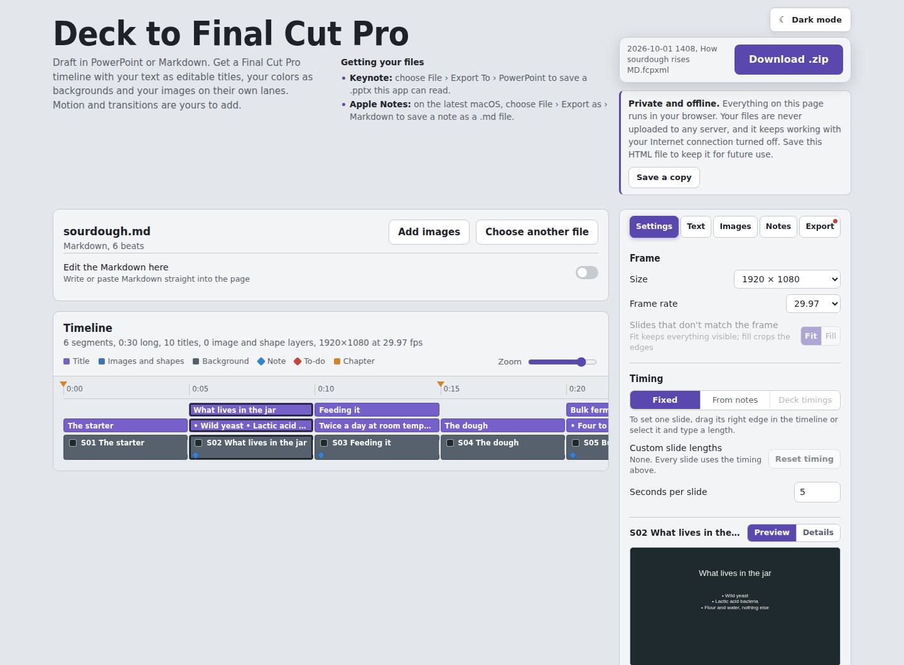

# Deck to Final Cut Pro

**Draft in PowerPoint, Keynote or Markdown. Finish in Final Cut Pro.**

Deck to Final Cut Pro turns a slide deck or a Markdown script into a Final Cut Pro project. Your text arrives as editable titles, your slide colors as backgrounds, and your pictures and shapes on their own layers, already laid out on a timeline. You add the motion, transitions, voice-over and music in Final Cut Pro.

It's a single web page. There's nothing to install, and your files never leave your computer.

<picture>
  <source media="(prefers-color-scheme: dark)" srcset="docs/screenshot-dark.png">
  
</picture>

## Why

Slides and outlines are a fast way to work out what a video says and in what order. Rebuilding that in an editor by hand is slow: retyping titles, matching colors, placing images and timing every beat. This app does that first assembly for you, so you start in Final Cut Pro with a rough cut instead of an empty timeline.

It's a one-way handoff. Write in the tool you know, convert once, then refine in Final Cut Pro.

## What comes across

| From your deck or script | In Final Cut Pro |
|---|---|
| Each slide, or each `##` beat in Markdown | A segment on the primary storyline |
| Slide background colors and pictures | The storyline clip under each segment |
| Titles, body text and bullets | Editable Basic Title clips with your font, size, color and position |
| Pictures, filled shapes and lines | Transparent image layers above the background, in slide order |
| Speaker notes | Markers, or a disabled "script" title you can read in the timeline |
| PowerPoint sections, or `#` headings in Markdown | Chapter markers |
| Charts, tables, SmartArt and other items the app can't convert | Red to-do markers telling you what to rebuild |

Animations, transitions and slide builds are deliberately left out. That part of the work belongs in Final Cut Pro.

## Quick start

1. **Open the app.** Open `index.html` in Safari, Chrome, Edge or Firefox, or use the hosted copy if this repository has GitHub Pages turned on.
2. **Add your file.** Drop a `.pptx` or `.md` file on the page, or click **Choose file**. The timeline and a preview appear right away.
3. **Adjust if needed.** Use the Settings, Text, Images, Notes and Export tabs. Click any segment to preview it, or drag its right edge to change its length.
4. **Download.** Click **Download .zip** and unzip it anywhere.
5. **Import.** In Final Cut Pro, choose **File › Import › XML** and pick the `.fcpxml` file inside the unzipped folder. Keep the `Media` folder next to it.

New to Markdown? Open [`examples/sourdough.md`](examples/sourdough.md) in the app to see a short script in action.

## Getting your files

- **PowerPoint:** save as `.pptx`.
- **Keynote:** choose **File › Export To › PowerPoint**.
- **Google Slides:** choose **File › Download › Microsoft PowerPoint (.pptx)**.
- **Apple Notes:** on the latest macOS, choose **File › Export as › Markdown**.
- **Any text editor:** save plain text with a `.md` extension. The [manual](docs/MANUAL.md#markdown-reference) lists the syntax the app understands.

## Private and offline

Everything runs in your browser. Decks and scripts are read and converted on your own computer and are never uploaded anywhere. The page has no server, no analytics and no account.

The app works with your Internet connection turned off. Click **Save this page** (or **Save a copy**) to keep it as a single HTML file in your Downloads folder, and open that file whenever you need it. When online, the page loads its interface font from Google Fonts; without a connection it uses your system font instead, and everything else works the same.

## Requirements

- **Final Cut Pro for Mac**, version 10.6 or later. Version 10.5 works if you choose FCPXML 1.9 on the Export tab.
- **A current browser:** Safari 16.2 or later, Chrome or Edge 111 or later, or Firefox 121 or later. The page also runs in Safari on iPad and iPhone, but you'll import the result on a Mac.
- **No installation, build step or package manager.** The one library it uses is built into the page; see [Dependencies](#dependencies).

## Documentation

- **[User manual](docs/MANUAL.md):** every setting, the Markdown syntax, how the Final Cut Pro project is built, and troubleshooting.
- **[Changelog](CHANGELOG.md)**
- **[Contributing](CONTRIBUTING.md):** how the code is organized and how to test changes.

## Dependencies

| Dependency | Purpose | License |
|---|---|---|
| [JSZip](https://stuk.github.io/jszip/) 3.10.2, including [pako](https://github.com/nodeca/pako) 1.0.11 | Reads `.pptx` files and writes the export `.zip` | MIT |
| [Instrument Sans](https://fonts.google.com/specimen/Instrument+Sans) (optional, not bundled) | Interface typeface, loaded from Google Fonts when online | SIL Open Font License 1.1 |

JSZip is inlined in `index.html`, so the page needs nothing else to run. Full license texts are in [THIRD-PARTY-NOTICES.md](THIRD-PARTY-NOTICES.md).

## Hosting it yourself

Because the whole app is one static file, any web host works. To use GitHub Pages, open the repository's **Settings › Pages**, choose **Deploy from a branch**, and select the `main` branch and the root folder. The app is then served from `index.html`.

## License

Released under the [MIT License](LICENSE). Bundled third-party code keeps its own licenses; see [THIRD-PARTY-NOTICES.md](THIRD-PARTY-NOTICES.md).

## Trademarks

Final Cut Pro, Keynote and Apple Notes are trademarks of Apple Inc. PowerPoint is a trademark of Microsoft Corporation. Google Slides is a trademark of Google LLC. This project is independent and isn't affiliated with, endorsed by or sponsored by any of them.
